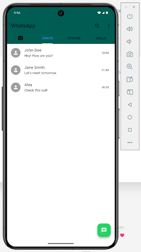

# WhatsApp UI Clone (Flutter)

## Group 3 Members

* 22K-4376 Khubaib Ahmed Jamil
* 22K-4367 Ayan Hasan
* 22K-4482 Muhammad Ahmed

This repository contains a **WhatsApp User Interface clone** developed using Flutter.
The project focuses only on recreating the **visual layout and UI components** of the WhatsApp application.

## Description

The goal of this project is to replicate the design of the WhatsApp mobile interface using Flutter widgets.
This implementation includes the main screen and UI elements but **does not include backend functionality or real messaging features**.

## Features

* WhatsApp-style home screen layout
* Chat list interface
* New chat button
* Tabs (Camera, Chats, Status, Calls)

## Technologies Used

* Flutter
* Dart
* Visual Studio Code
* Git

## Screenshots

### Home Screen

